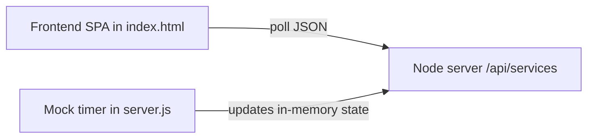

# Copy this onto your Miro board (3 items)

Use three separate frames or sticky clusters so the MCP can read clear context.

---

## 1) PRD — API Status Dashboard

**Goal:** Single-page web app that shows health of several internal APIs.

**Audience:** Developers and SREs glancing at a wallboard or local monitor.

**Features:**

- List named services with IDs.
- Status per service: Online (green), Degraded (yellow), Offline (red).
- Numbers at top: total, online, degraded, offline.
- Data refreshes automatically (mock backend that changes status every few seconds).
- Show last-updated timestamp per service.

**Non-goals:** Real auth, real integrations, persistence.

---

## 2) Architecture (text + Mermaid)

**Stack:** Node.js HTTP server, no framework. One JSON endpoint `GET /api/services`. Static `public/index.html` with `fetch` polling every ~2s.

**Mermaid (paste in a doc sticky if you like):**

---

## 3) Data flow (short diagram notes)

- **Mock data service** (in-process timer on the server) randomly adjusts each service’s status.
- **Frontend** polls `/api/services` and re-renders cards and summary counts.
- **User** opens `http://localhost:3000` in a browser.
